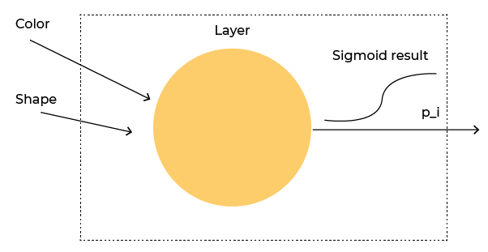
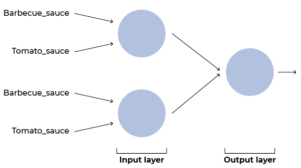
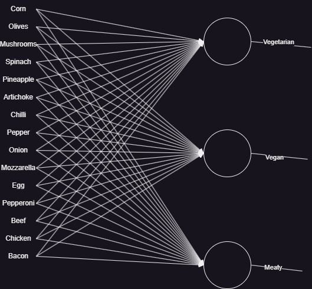
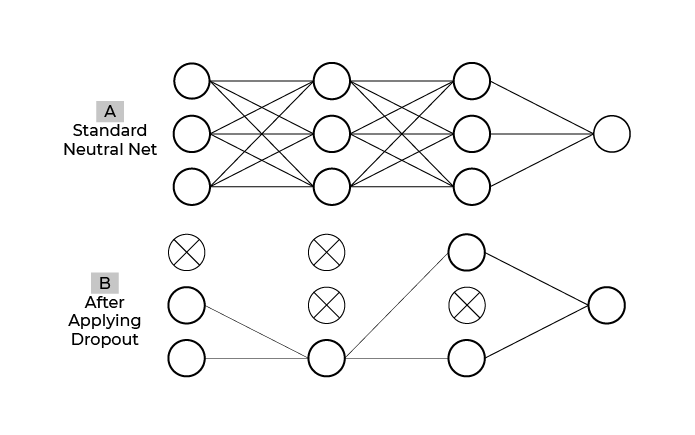

# Deep Learning Project

## Introduction

The goal of this repository is to store all the various files needed for completing [this course](https://openclassrooms.com/en/courses/6532316-introduction-to-deep-learning-models) on deep learning.

I want to use this project as a way of getting to know a new theme in my computer science journey all while studying at the HEIG-vd for my bachelor's degree.

[Here](https://github.com/Disruptive-Engineering-Limited/introduction-to-deep-learning) is a link to the repository I get to look at in case of difficulty completing a step.

## Steps

### 1. Single Neuron

In this exercise the goal is to create our first neural network consisting of just one neuron.
This does not really have any real world applications but at least it gets us started.

The reason behind this exercise is differentiating between two variables, in this case olives and corn.
We are given information on shape and colour and from this the neuron has to decide whether it is an olive or corn.

### 2. Multiple Neurons

This time we are asked to train multiple neurons to have an actual network.

We can't use one single neuron because we have more than two possible scenarios.
Therefore we have to create a multi layer model.

This time the reason for this network is to decide whether there has been an error with the sauce on a pizza.
There are two available sauces but a pizza should have 1 and only 1 on it.
Therefore if the pizza has either no sauce or both, there is a problem.

### 3. Multiple Output Neurons

In this part the goal is to create a network with several output neurons.
We need to make sure the outputs are mutually exclusive as we want the possible categories to be unique for each measurement.
There is no need for multiple layers in this model, simply having an output layer with n neurons for n categories (in this case n = 3).
Each neuron will have all the inputs for the network (in this case 15).

The use case for this model is presented as a detection system for deciding what colour box to put each pizza in.
It checks the ingredients on the pizza and the neural network has to decide whether that makes the vegetarian, vegan or meaty.

### 4. Deep Fully Connected Network

This exercise guides us in the creation of a deep fully connected network.
We now have 3 layers to our network, input, hidden and output which allow for more complex computing.
This time we use a function called dropout which basically does not activate some random neurons for an epoch.
This avoids having dependencies on preceding parts of the network.

We also employed rectified lineau units (ReLU) so as to avoid gradient vanishing during backpropagation of the error through multiple layers.

Lastly we used batches to decide after how many predictions the weights should be updated.

The reason for this network is to predict whether their will be traffic depending on the day and the time.